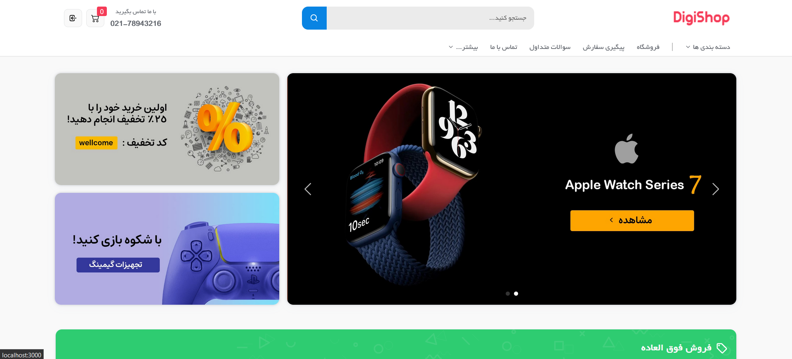
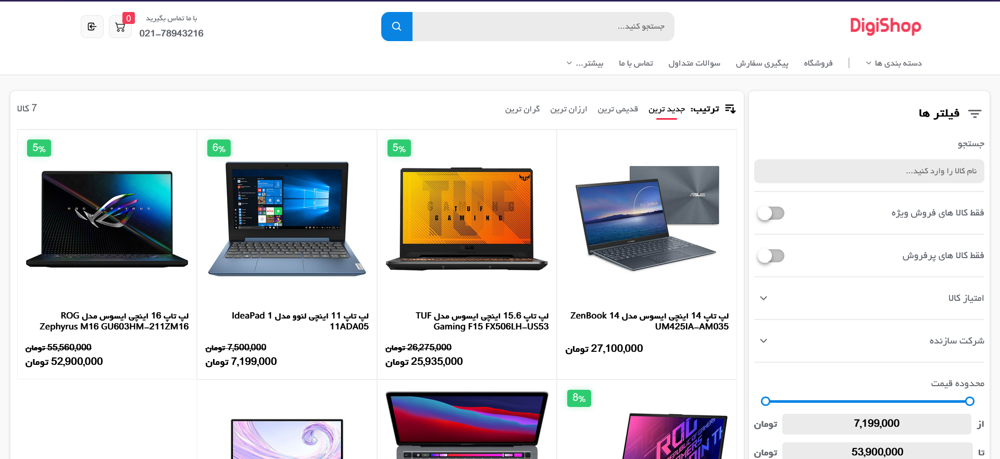

# DigiShop
an online shop to browse, review and buy electronic devices.

---

## Description
this project has been created using react.js, in order to create a realistic PWA.the challenge of this project was implementing the backend servers.
[firebase](https://firebase.google.com/) is used as authentication server to add sign up / log in functionality to the project, and [contenful](https://www.contentful.com/) is used as content delivery api.

## Installation
`npm install && npm start`
>Note that in order to connect to the firebase server, vpn connection is required.

## Author
Mohammdad sina kazemi

## License
project content source : digikala.com

